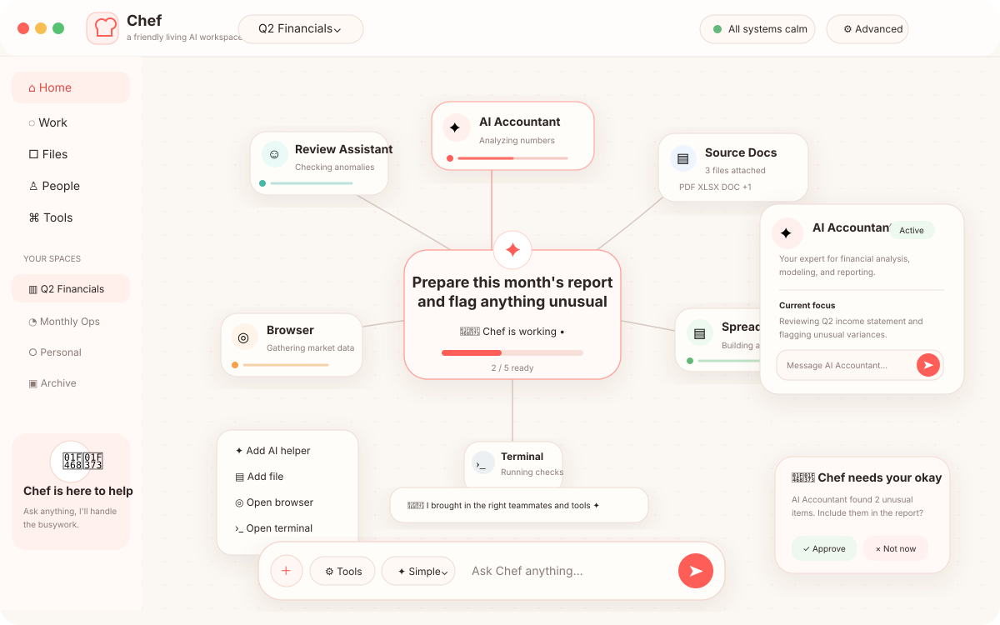

# Chef — Living Workspace UI Overhaul

## North star

Chef should feel like giving work to a small, capable team, not programming a workflow engine.

The runtime remains unchanged: Missions, Tasks, canvas nodes, typed edges, approvals, artifacts, sessions, and events stay authoritative. The friendly UI is only a projection over that state.

## Visual north star

The generated living-workspace mockup is now an explicit reference for future UI iterations:

Use it as a visual direction, not as a pixel-exact contract. The important qualities are:

- warm, soft, friendly presentation instead of IDE chrome
- the current Work/Mission as the strongest central object
- small approachable workers and tools arranged spatially around the work
- a floating Chef composer as the main control surface
- contextual teammate cards instead of a permanent inspector
- friendly approval/result surfaces that feel part of the workspace
- restrained coral/red accent, with muted green/teal/orange only where state needs distinction
- subtle motion, soft depth, and playful details without turning the canvas into visual noise

The mockup also explores a lightweight Home/navigation rail. Treat that as a **Home-shell idea**, not a requirement for active Work. Once the user enters active work, the canvas should stay visually dominant and permanent navigation should recede rather than rebuilding a dashboard-heavy layout.

## Interaction model

### 1. Intent first

The primary control is the floating Chef composer. A user describes an outcome in plain language. Chef creates or adapts a Mission and the workspace grows around that work.

There is no global **Run Workflow** action for normal Mission work.

### 2. Work in the center

The visual center is the user's current goal, not an Orchestrator implementation node. Workers and tools appear around the goal as Chef uses them.

Mission-to-worker spokes in the friendly view are presentation-only membership relationships. They do not create new runtime edge semantics or mutate authoritative canvas state.

### 3. Living objects, not configuration cards

Friendly nodes use an icon, name, and human-readable live state. Runtime details stay hidden until the user asks for them.

Clicking an object opens a small contextual card. It can expose a direct message, open/activate action, retry when appropriate, and a path to advanced details.

### 4. Progressive depth

Chef does not need to classify a person as a "simple" or "power" user. The default experience stays approachable and the existing advanced workbench remains available when deeper control is useful.

The same underlying node can therefore be experienced at increasing depth:

`object → contextual card → advanced workbench → terminal/runtime details`

### 5. Semantic presentation

The friendly projection can arrange runtime objects around the active work without overwriting their persisted canvas positions. The advanced workbench retains direct graph editing and authoritative saved geometry.

## Visual language

- warm off-white canvas instead of IDE-dark chrome by default
- minimal permanent navigation during active work
- compact icon/orb nodes rather than large configuration cards
- subtle curved relationships
- coral/red Chef accent used deliberately for active work
- soft paper-like surfaces and restrained blur
- rounded, slightly asymmetric shapes so the UI feels friendly without becoming toy-like
- motion communicates state: spawn, connect, work, result, attention
- reduced-motion preferences are respected

The implementation intentionally uses CSS/Web Animation-style motion in this first slice rather than adding a new animation dependency. It gives the prototype spring-like entrances, working halos, flowing edges, staggered tool reveals, and micro-interactions while keeping the existing npm lock surface unchanged. A dedicated motion library can be introduced later if orchestration choreography becomes complex enough to justify it.

## Friendly vocabulary

| Runtime term | Friendly presentation |
| --- | --- |
| Mission | Work / your work |
| Task | What a teammate is doing |
| Agent | Teammate / AI helper |
| Artifact | Result / file |
| Approval | Needs your okay |
| Harness | Hidden by default |
| PTY/session | Hidden by default |
| Edge relationship | Visual relationship |

## Acceptance criteria for this slice

1. Simple/default presentation opens as a quiet, full-screen living workspace rather than the old sidebar-heavy workbench.
2. The Chef composer is the dominant interaction.
3. Sending a goal calls the existing runtime chat/Mission path.
4. Runtime Mission/Task/canvas state remains the source of truth.
5. The current goal is shown as a central work object.
6. Runtime nodes are projected as friendly compact objects around the work.
7. Active nodes and edges communicate work through restrained motion.
8. Selecting a node opens a contextual card rather than a permanent inspector.
9. Direct node messaging uses the existing runtime intervention endpoint.
10. Adding an AI helper, File, Browser, or Terminal uses existing node/runtime APIs.
11. Pending approvals remain visible and actionable.
12. Advanced mode preserves the existing detailed workbench and runtime controls.
13. No synthetic friendly-view layout is persisted back as authoritative node geometry.
14. `prefers-reduced-motion` disables non-essential animation.

## Next-iteration guardrails

When iterating from the mockup, prefer these changes first:

1. Make Home more welcoming and navigable without making active Work sidebar-heavy.
2. Improve artifact/result cards so outputs can become spatial objects in the workspace.
3. Refine node micro-interactions, selected-node transitions, and work-state choreography.
4. Add richer semantic zoom before exposing more permanent panels.
5. Keep advanced runtime concepts discoverable through depth, not visible by default.

Do **not** turn the reference into a conventional dashboard with a permanently dominant left rail, permanent inspector, or many top-level product sections. The active-work experience should still feel like a quiet spatial canvas that happens to have friendly navigation around it.
